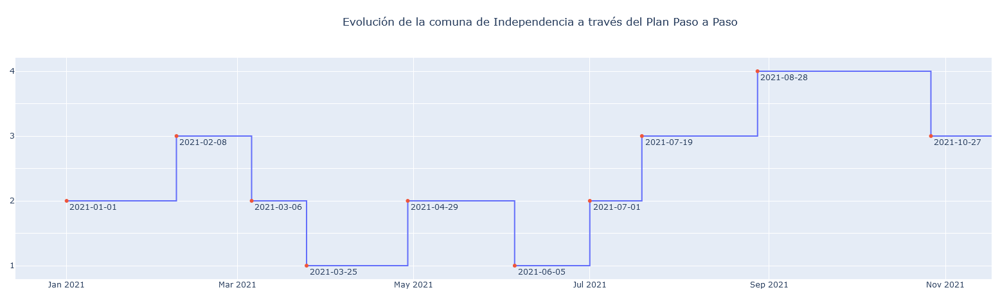

# Memoria DEGI

Este repositorio contiene parte del trabajo realizado para la Dirección Económica y de Gestión Institucional de la Facultad de Medicina de la Universidad de Chile. Este cuaderno Jupyter obtiene datos del plan Paso a Paso desde el producto 74 del repositorio [MinCiencia/Datos-COVID19](https://github.com/MinCiencia/Datos-COVID19) y genera un gráfico para la comuna de Independencia (o cualquier otra comuna que se indique en el código) a partir de enero de 2021.

## Output

La siguiente imagen corresponde al gráfico generado el día 22 de noviembre de 2021. Para obtener resultados actuales, se requiere la ejecución del cuaderno Jupyter en cualquier ambiente que lo permita, como Google Colab.

